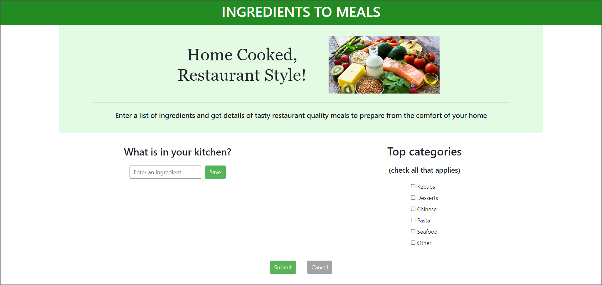

# Ingredients To Meals 🥗 📖
Welcome to Ingredients To Meals, the meal prep application! The application developed is designed to help users plan and prepare meals based on the ingredients they have on hand. It could be particularly useful for individuals who are looking to use up ingredients they already have on hand before they go shopping for more, or for those who are trying to save money by minimizing food waste. 

### - Benfits 
- Save time and effort searching for recipes and meal ideas
- Use up ingredients you already have on hand, reducing food waste and saving money
- Quickly and easily plan meals to suit your preferences and dietary needs

## Table of contents 🥙
- [The Application](https://github.com/xiacodes/Ingredients-To-Meals/edit/main/README.md#the-application-)
- [Getting Started](https://github.com/xiacodes/Ingredients-To-Meals/edit/main/README.md#gettting-started-)
- [Requirements](https://github.com/xiacodes/Ingredients-To-Meals/edit/main/README.md#requirements)
- [Credits](https://github.com/xiacodes/Ingredients-To-Meals/edit/main/README.md#credits)

## Screenshot 🥪

## The Application 🌮
How the application works is that once the user has entered this raw indgredients information, the application will use third party application programming interfaces (APIs) to search for possible recipes and meal ideas that can be made using the ingredients the user has indicated they have available. 

The APIs will compare the user's ingredients to a database of menu items and return suggestions for meals that can be made with those ingredients, along with detailed recipes and cooking instructions. This will allow users to quickly and easily plan meals and make the most of the ingredients they have on hand, without having to spend time searching for recipes or menu ideas on their own.

### - Deployment Link
Here is the link to the completed application: _[>> link <<]()_

## Gettting Started 🌯
To use Ingredients To Meals, simply follow these steps:

1. Enter in the ingredients you have available in your refrigerator.
2. Wait for the application to do its *magic*
3. Select a recipe from the list of suggestions provided by the application.
4. Follow the provided cooking instructions to prepare the meal.

## Requirements 🍲
- An internet connection is required to use the application and access the third party API.
- A modern web browser is recommended for the best user experience.

## Credits 🍵
*Ingredients To Meals* was developed by Christina and myself. The application uses a third party API to search for recipes and provide meal ideas. Thank you to [names of the API Providers inserted here as links] for their valuable contribution to this project.
